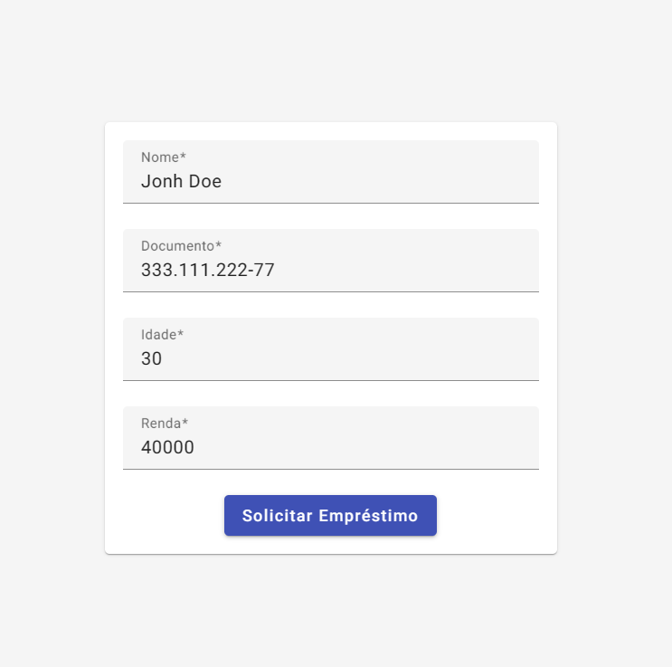
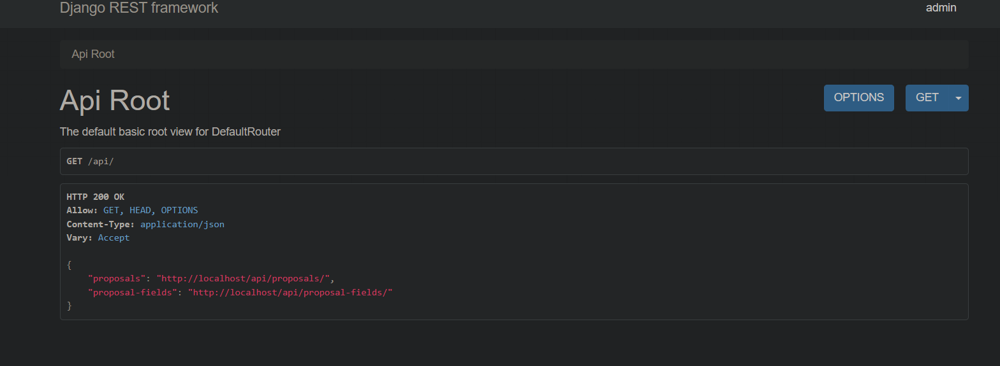
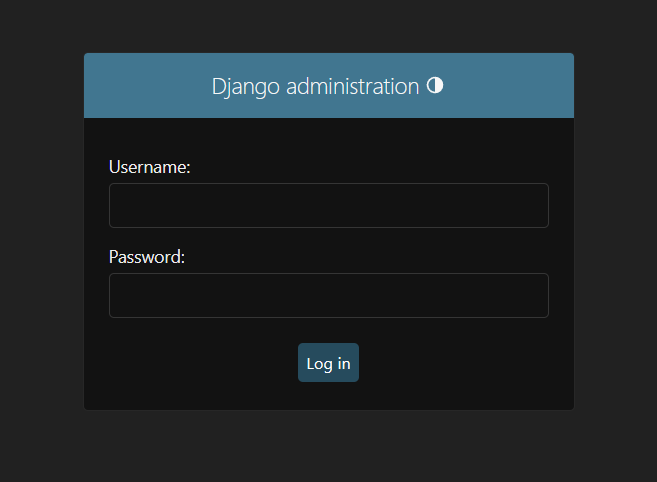
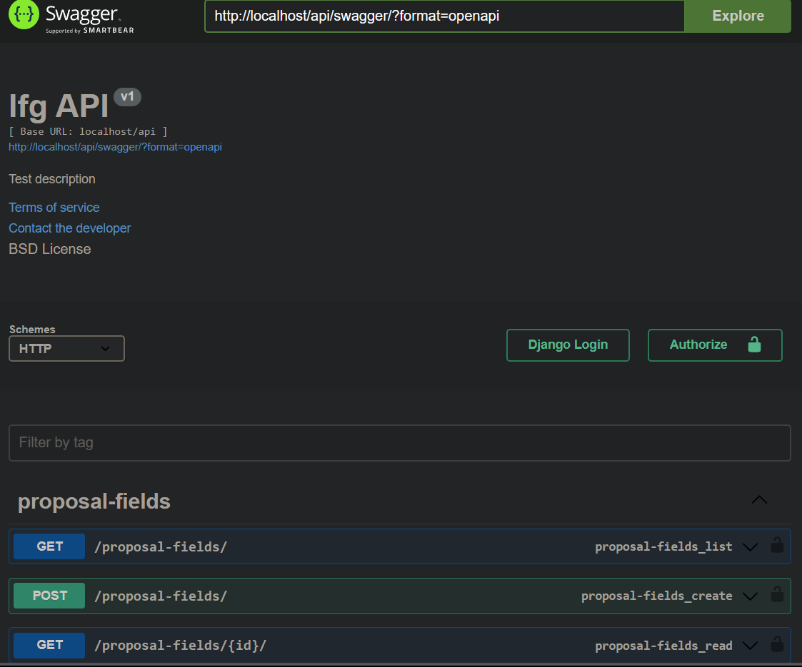

# FullStack Django + Angular project

## Descrição

Este projeto é uma aplicação web desenvolvida utilizando várias tecnologias, incluindo Django, Django Rest Framework, Celery, Angular, Nginx e Docker. A aplicação consiste em um backend desenvolvido com Django e Django Rest Framework, um frontend desenvolvido com Angular, e o Nginx é utilizado como um servidor web reverso para rotear as solicitações para o frontend e o backend. O Celery é utilizado para lidar com tarefas assíncronas. Tudo é empacotado e orquestrado utilizando Docker e Docker Compose.

## Tecnologias Utilizadas

- Django
- Django Rest Framework
- Celery
- Angular
- Nginx
- Docker

## Como Rodar o Projeto

Para rodar o projeto, você precisa ter o Docker e o Docker Compose instalados na sua máquina.

1. Primeiro, navegue até o diretório `docker`.
2. Em seguida, execute o seguinte comando para iniciar todos os serviços: `docker-compose up --build`


## Acessando a Aplicação

Após iniciar todos os serviços, a aplicação estará disponível nos seguintes endereços:

- Frontend: [http://localhost](http://localhost)



- Backend/API: [http://localhost/api](http://localhost/api)



- Admin do Django: [http://localhost/api/admin](http://localhost/api/admin)



- Swagger do Django: [http://localhost/api/swagger](http://localhost/api/swagger)



## Requisição de Exemplo

Você pode fazer uma requisição para a API com o seguinte corpo:

``` json
{
    "name": "John Doe",
    "document": "123456789",
    "data": {
        "age": 30,
        "income": 50000
    }
}
```

## Acessando o Admin do Django

Você pode acessar o admin do Django utilizando as seguintes credenciais:

- Usuário: admin
- Email: admin@example.com
- Senha: adminpass

## Limpeza do Docker

Se você desejar limpar todos os containers, imagens e volumes do Docker na sua máquina, você pode usar os scripts de limpeza fornecidos.

- No Windows, você pode usar o `clean-docker.ps1` executando o seguinte comando no PowerShell: `./clean-docker.ps1`


- No Linux ou Unix, você pode usar o `chmod +x clean-docker.sh` e executando o seguinte comando no terminal: `./clean-docker.sh`


## Conclusão

Este é um projeto básico que utiliza várias tecnologias populares. Você pode usar este projeto como um ponto de partida para o seu próprio projeto, adaptando-o conforme necessário.


